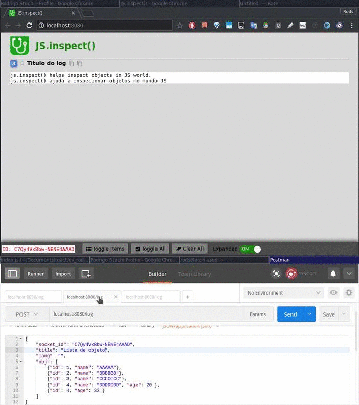
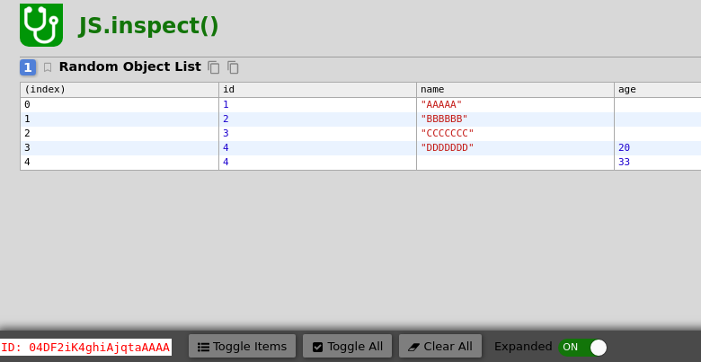
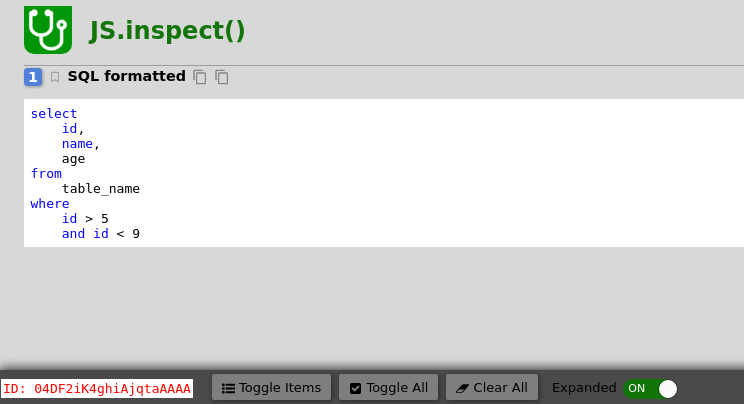

# Why JS.inspect()?

## JS.inspect was made to help inspect objects, strings, sql queries in any system that runs javascript when Debug is not available or is too much intrusive.

 - React Native
 - browser
 - Nodejs
 - NativeScript

## Demo


# How to install?

    yarn global add js.inspect 
    npm i -g js.inspect

# Usage
 
**POST**

    http://localhost:8080/inspect

**body** application/json
```json
{
	"socket_id": "4JLn0IALS0J_sk-2AAAB",
	"title": "Random Object List",
	"lang": "", 
	"obj": [
		{"id": 1, "name": "AAAAA"},
		{"id": 2, "name": "BBBBBB"},
		{"id": 3, "name": "CCCCCCC"},
		{"id": 4, "name": "DDDDDDD", "age": 20 },
		{"id": 4, "age": 33 }
	]
}
```


**body** application/json
```json
{
	"socket_id": "04DF2iK4ghiAjqtaAAAA",
	"title": "SQL formatted",
	"lang": "sql", 
	"obj": "select id, name, age from table_name where id > 5 and id < 9"
}
```



[Demo YouTube](https://www.youtube.com/watch?v=Cl-B5XdSCIY)